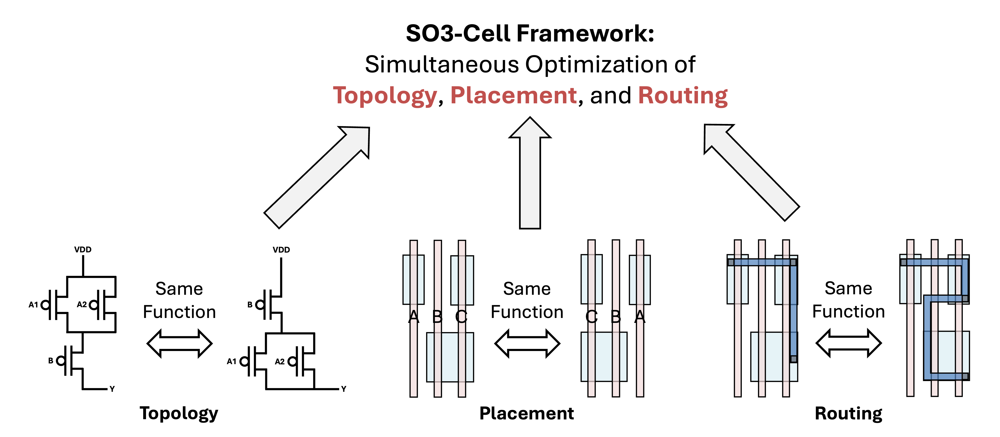

# SO3-Cell: Standard Cell Layout Automation Framework for Simultaneous Optimization of Topology, Placement, and Routing



This repository is a comprehensive collection of assets for the **SO3 standard cell generation framework**, including its source code and a full set of pre-generated library views.

The repository structure is as follows:

*   **`./Framework`:** This directory holds the core source code of the **SO3 Framework**, which is responsible for the automated generation of standard cell layouts.
*   **`./Enablement`:** This directory provides a complete enablement kit, containing both the inputs for the framework and its pre-generated outputs.
    *   **Circuit Netlists (`./Enablement/cdl`):** The SPICE netlists that describe the circuits to be generated.
    *   **Timing Libraries (`./Enablement/lib`):** Pre-generated timing library (`.lib`) files for static timing analysis.
    *   **Physical Libraries (`./Enablement/lef`):** Layout Exchange Format (LEF) files describing the physical abstracts of the cells for place-and-route.
    *   **Layout Data (`./Enablement/gds`):** The final GDSII stream files containing the full mask layout data.
    *   **Database Files (`./Enablement/db`):** Synopsys-compatible database (`.db`) files for use in synthesis and P&R tools.

## Prerequisites

To set up and run this project, you will need the following dependencies installed on your system.

### System Dependencies

*   **Python** (version 3.10)
*   **KLayout** (version 0.29)

### Gurobi License

This project utilizes **Gurobi** as its MILP (Mixed-Integer Linear Programming) solver. Therefore, a valid Gurobi license is required to run the framework.

If you are a student or a member of a university faculty, Gurobi provides a **free, full-featured academic license**. Please visit the link below to register and obtain your license:

*   [Gurobi Academic Program & Licenses](https://www.gurobi.com/academia/academic-program-and-licenses/)

### Python Packages

Install the required Python packages using pip:

```bash
pip install gurobipy
```

## Running the Framework

Follow these steps to generate the standard cell layouts.

First, change your current directory to the `Framework` directory, which contains the main execution script.

```bash
cd Framework
```

Next, run the `run_cell.sh` script. This will initiate the entire flow, from reading the netlist to generating the final GDSII layout file.

```bash
./run_cell.sh
```

## Notes


# Reference
