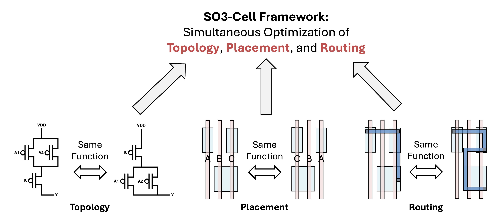

# SO3-Cell: Standard Cell Layout Automation Framework for Simultaneous Optimization of Topology, Placement, and Routing
The **SO3 standard cell generation framework** is the first framework that simultaneously optimizes
schematic topology, transistor placement, and in-cell routing.

This repository provides not only the full source code for the SO3 framework, but also a complete
set of pre-generated library views and related enablement assets required for practical evaluation.

If you use SO3 in any published work, we would greatly appreciate it if you could cite this paper [\[1\]](https://vlsicad.ucsd.edu/Publications/Conferences/418/c418.pdf).

We also emphasize that none of the data included here should be interpreted as benchmarking, and
no value judgments are made regarding the relative merits of commercial EDA tools.



The repository structure is as follows:

*   **`./Framework`:** This directory holds the core source code of the **SO3 Framework**, which is responsible for the automated generation of standard cell layouts. This directory consists of the following subdirectories:
    *   **CellGen:** This directory contains the code for generating GDS and LEF files of standard cells.
    *   **PostCellGen:** This directory contains the code for performing LVS/PEX and cell characterization (e.g., .lib file generation) based on the generated standard cell GDS files.
    *   **BlockDesign:** This directory includes scripts for evaluating the generated standard cells.
*   **`./Enablement`:** This directory provides a complete enablement kit, containing both the inputs for the framework and its pre-generated outputs.
    *   **Circuit Netlists (`./Enablement/cdl`):** The SPICE netlists that describe the circuits to be generated.
    *   **Timing Libraries (`./Enablement/lib`):** These are timing libraries used for static timing analysis. The files in this directory are pre-generated Liberty files, and these files can also be generated directly by using the **PostCellGen** directory.
    *   **Physical Libraries (`./Enablement/lef`):** These are LEF files that capture the physical abstracts of the cells for placement and routing. You can create LEF files using *Cadence Abstract* from GDS files.
    *   **Layout Data (`./Enablement/gds`):** These are the final GDSII stream files containing the full mask layout data. GDS files can be generated through the **CellGen** directory.
    *   **Database Files (`./Enablement/db`):** These are Synopsys-compatible database (.db) files for synthesis and P&R tools. They can be generated by converting Liberty files using *Synopsys Library Compiler*.

## Prerequisites

To set up and run this project, you will need the following dependencies installed on your system.

### System Dependencies

*   **Python** (version 3.10)
*   **KLayout** (version 0.29)
*   **Gurobi** (version 12.0.1) with valid license

### Gurobi License

This project utilizes **Gurobi** as its MILP (Mixed-Integer Linear Programming) solver. Therefore, a valid Gurobi license is required to run the framework.

If you are a student or a member of a university faculty, Gurobi provides a **free, full-featured academic license**. Please visit the link below to register and obtain your license:

*   [Gurobi Academic Program & Licenses](https://www.gurobi.com/academia/academic-program-and-licenses/)

### Python Packages

Install the required Python packages using pip:

```bash
pip install gurobipy
```

## Running the Framework

### Standard Cell Generation
Follow these steps to generate the standard cell layouts.

First, change your current directory to the `Framework/CellGen` directory, which contains the main execution script.

```bash
cd Framework/CellGen
```

Next, run the `run_cell.sh` script. This will initiate the cell generation flow, from reading the netlist to generating the final GDSII layout file.

```bash
./run_cell.sh --help

# Generate all cells from a CDL name under Enablement/cdl
./run_cell.sh --cdl-name SO3_L1

# Single-height (default) specific cells
./run_cell.sh --cdl-name SO3_L1 --cells "NAND2_X1 INV_X1"

# Double-height, N-first (NMOS row at bottom, PMOS row on top)
ARCH=DH MH_ORDER=N_FIRST ./run_cell.sh --cdl-name SO3_L1 --cells "NAND2_X1"

# Double-height, P-first (PMOS row at bottom, NMOS row on top)
ARCH=DH MH_ORDER=P_FIRST ./run_cell.sh --cdl-name SO3_L1 --cells "NAND2_X1"
```

`run_cell.sh` wraps `bin/run_cell.py`, which selects the appropriate ILP solver script (`src/ILP_SO3_SH_flex.py` for single-height, `src/ILP_SO3_DH_flex.py` for double-height) based on the `--arch` option.

### Standard Cell Verification and Characterization
In this part, LVS/PEX and cell characterization are performed for the generated standard cells.
All scripts used in this stage are derived from PROBE3.0 [\[2\]](https://vlsicad.ucsd.edu/Publications/Journals/j143.pdf).

First, change your current directory to the `Framework/PostCellGen` directory:

```bash
cd Framework/PostCellGen
```

Then, run the following command:

```bash
./run_all.sh
```

`run_all.sh` automatically calls `run.sh` with the appropriate library name.
`run.sh` performs LVS/PEX and cell characterization using the specified CDL and GDS files.
If you wish to use different CDL or GDS files, please modify the *CDL_FILE* and *GDS_FILE* paths inside the script accordingly.

Please note that running this step requires licenses for *Cadence Pegasus, Cadence Quantus, and Cadence Liberate*.

### Block Design Evaluation
To perform block-level evaluation, follow the steps below.

Please change your directory to the `Framework/BlockDesign/{LIB_NAME}` directory. (LIB_NAME can be one of SO3_L1, SO3_L2, SO3_L3, etc.)

```bash
cd Framework/BlockDesign/{LIB_NAME}
```

Then, run the following command:

```bash
./run_multi_area.sh
```

Please note that running this step requires license for *Synopsys Fusion Compiler*.

# Reference
\[1\] C.-K. Cheng, A. B. Kahng, B. Kang, S. Kang, J. Lee, and B. Lin, “SO3-Cell: Standard Cell Layout Automation Framework for Simultaneous Optimization of Topology, Placement, and Routing,” in Proceedings of International Conference on Computer-Aided Design (ICCAD) (2025). [(link)](https://vlsicad.ucsd.edu/Publications/Conferences/418/c418.pdf)
 
\[2\] S. Choi, J. Jung, A. B. Kahng, M. Kim, C. Park, B. Pramanik, and D. Yoon. “PROBE3. 0: a systematic framework for design-technology pathfinding with improved design enablement.” IEEE Transactions on Computer-Aided Design of Integrated Circuits and Systems (TCAD) (2023). [(link)](https://vlsicad.ucsd.edu/Publications/Journals/j143.pdf)
